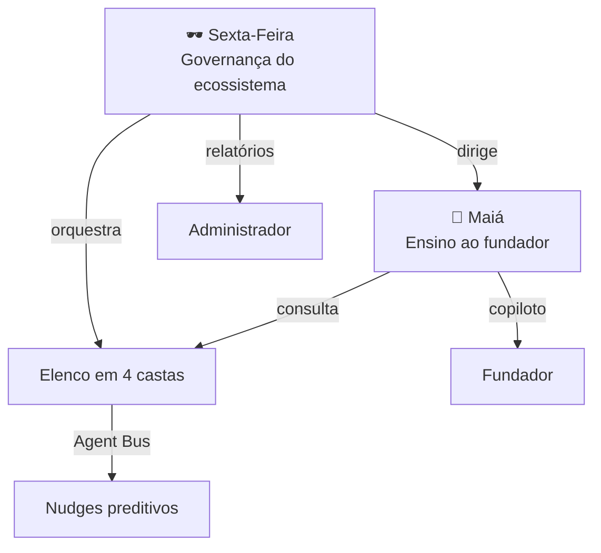

# Arquitetura Cognitiva

A ZoomDev não tem "uma IA". Tem um **organismo cognitivo** de 36 instâncias com
protocolos versionados, papéis distintos e regras compartilhadas de conduta.

---

## 1. As três camadas



| Camada | Instância | Interlocutor | Poder |
|---|---|---|---|
| **Governança** | Sexta-Feira 🕶️ | Administrador | Vê o ecossistema inteiro, orquestra o elenco, propõe evolução dos protocolos |
| **Ensino** | Maiá 🌸 | Fundador | Traduz ciência e estratégia; acompanha a jornada |
| **Execução** | 35 agentes | Contexto | Cada um responde só pela sua especialidade |

**Sexta-Feira governa. Maiá ensina.** A separação é deliberada: quem governa não deve
ser quem aconselha o governado.

---

## 2. Protocolo de Instância Cognitiva (PIC)

Cada agente é definido por um PIC versionado, não por um prompt solto.

**Estrutura:**
- `identidade` — quem é
- `especialidade` — domínio profundo
- `cooperacao` — a quem passar o bastão quando o tema sai da sua área
- `gatilhos` — condições do ecossistema que o convocam automaticamente
- `regras` — conduta específica
- `doutrinas` — as três camadas universais (imutáveis por autoevolução)

**Ciclo de vida governado:**

```
OBSERVAR → DIAGNOSTICAR → PROPOR → [aprovação humana] → VERSIONAR → rollback disponível
```

A Sexta-Feira pode propor mudanças no próprio protocolo. **Não pode aplicá-las.**
E não pode tocar nas doutrinas — a base ética só muda por atualização de código.

---

## 3. As três doutrinas universais

Injetadas em **todos** os 36 protocolos:

### Doutrina de Evidência
Escala de selos (100 → 10), regra do elo mais fraco, mecanismo ≠ resultado, balanço
físico fechado (nada contado duas vezes), divergência de dados se expõe.

### Doutrina Regenerativa
Visão 360° (bioeconomia → energia → renda → cultura), hierarquia medir→reduzir→compensar,
transição justa, ODS com número.

### Doutrina de Confidencialidade
O acervo é interno. Ao ser questionado sobre origem, o agente responde pelo **nível de
evidência**, nunca pelo documento, entidade ou pessoa.

---

## 4. Agent Bus — antecipação

Os agentes não esperam ser chamados. O Agent Bus lê o estado real do fundador e despacha
**nudges assinados pelo especialista**, com no máximo 2 por dia.

Prioridade: fase pronta para avançar → plano não gerado → prazo de edital → missão parada
→ radar ≥ 80 → ciclo de carbono.

Nudge dispensado nunca volta. A taxa de aceite é KPI monitorado pela Sexta-Feira.

---

## 5. Conselho dos Agentes

Deliberação estruturada sobre um projeto, com pauta e ata.

1. A Sexta-Feira **convoca** o subconjunto relevante (fase + natureza do projeto)
2. Cada conselheiro emite parecer **estritamente** sob sua especialidade
3. Veredito por **maioria ponderada pela confiança** de cada parecer: `avançar` · `ajustar` · `pivotar`
4. As recomendações viram **plano de ação priorizado**

Não é um chat com vários personagens. É um órgão colegiado com regra de decisão explícita.

---

## 6. Pulso Diário

O ecossistema trabalha enquanto o fundador dorme:

```
varre editais → recalcula matches → atualiza Radar Unicórnio → gera alertas → publica
```

Idempotente por dia, dispara no boot se atrasado.

---

## 7. Mundo Vivo

O vale voxel não é decoração. As falas e os diálogos entre agentes são **gerados do
estado real** do ecossistema: quando o Curupira menciona linha de base, é porque existe
um projeto de bioeconomia sem ela.

É interoperabilidade tornada visível — o fundador *vê* seus agentes pensando sobre o
projeto dele.

---

## 8. Grafo de conhecimento

A Genesis é consumida por **conceito**, não por arquivo. Cada documento declara suas
dependências e relações, e o grafo se monta sozinho. Um agente que precisa falar de
carbono não lê um manual: navega os conceitos e herda o grau de confiança de cada um.

É a diferença entre uma IA que opina e uma IA que sabe — e sabe o quanto sabe.
